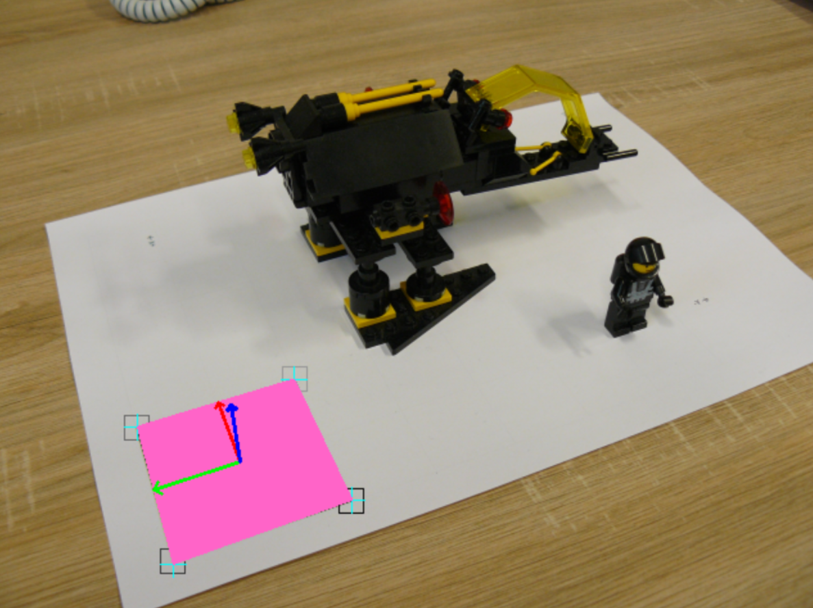

# Projects for Multimedia Data Processing class

Using OpenCV

	- RGB to YUV & YUV to RGB
	- Bayer filter
	- generating HDR picture using exposure bracketing
	- camera calibration using set of chessboard images
	- finding QR marker in scene for AR purposes

